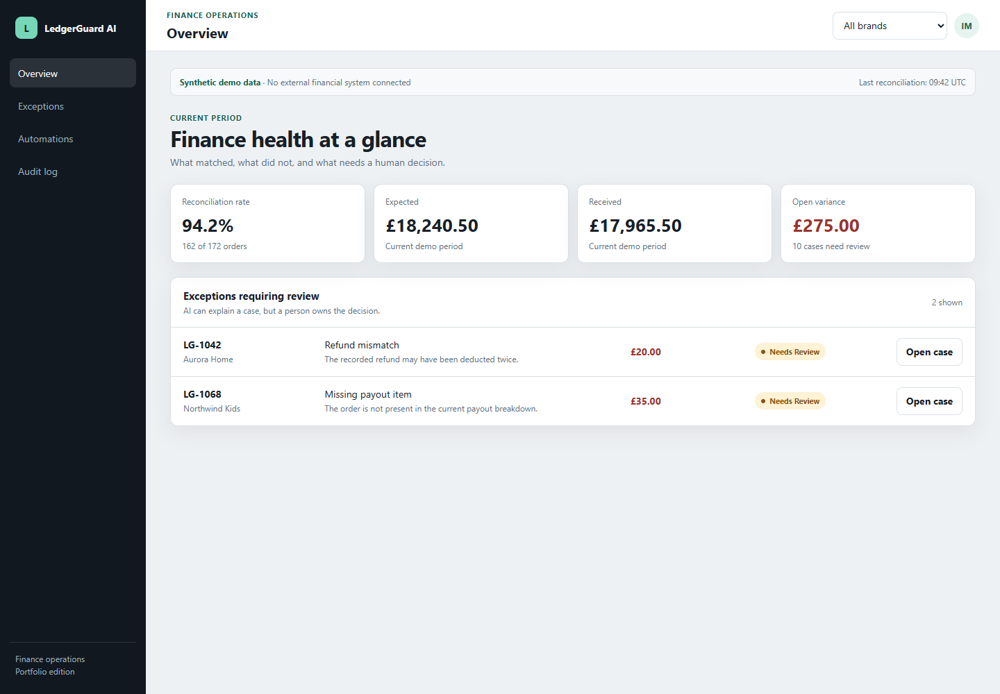
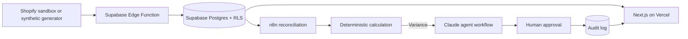

# LedgerGuard AI

LedgerGuard AI is a portfolio-safe finance operations product for multi-brand e-commerce reconciliation. It shows how order, refund, fee, and payout evidence can be combined into a deterministic calculation, an explainable AI-assisted investigation, and a human approval flow.

> **Current status:** foundation milestone. The application is functional with synthetic local data. Supabase, n8n, Shopify, Claude, and external financial systems are not connected yet.

**Live demo:** [ledgerguard-ai-three.vercel.app](https://ledgerguard-ai-three.vercel.app)



## Why this project exists

Finance teams can lose time investigating why an e-commerce payout does not match the expected value. LedgerGuard AI is designed to centralise that evidence, calculate the variance without AI, propose a traceable explanation with AI, and keep a person responsible for the final decision.

## Current foundation

- Next.js App Router with TypeScript;
- responsive finance operations interface;
- overview, exception, automation, and audit views;
- deterministic reconciliation in integer minor units;
- synthetic case `LG-1042` with a £20.00 payout variance;
- local human approval interaction;
- unit tests for the reconciliation rules;
- CI, pull request template, and an active Vercel deployment;
- Claude Code project guidance and specialist agent definitions;
- future integration boundaries for Supabase and n8n;
- no secrets, customer data, or external requests.

## Demo story

1. A synthetic order has a gross value of £120.00.
2. A £20.00 refund and £3.50 processing fee produce a £96.50 expected payout.
3. The synthetic actual payout is £76.50.
4. Deterministic code identifies the £20.00 variance.
5. The interface shows an evidence-backed AI hypothesis.
6. A finance manager approves or rejects an investigation—not a money movement.

All values are fictional and are not business outcomes.

## Run locally

Requirements: Node.js 22+ and pnpm 11.

```bash
pnpm install
pnpm dev
```

Open [http://localhost:3000](http://localhost:3000).

## Verify

```bash
pnpm check
```

The command runs linting, TypeScript checks, unit tests, and a production build.

## Architecture direction



The diagram describes the approved target architecture. Only the Next.js synthetic foundation and reconciliation rules exist in this milestone.

## Repository map

```text
.
├── .claude/agents/        # Specialist Claude Code reviewers
├── .github/               # CI and pull request quality gate
├── app/                   # Next.js application
├── components/            # Product interface
├── docs/                  # TDD, security, and decision evidence
├── lib/                   # Types, synthetic data, deterministic rules
├── n8n/                   # Future sanitized workflow boundary
├── prompts/               # Future versioned runtime prompts
├── supabase/              # Future migrations, functions, and RLS tests
└── tests/                 # Automated rule tests
```

## Safety boundary

- public mode uses synthetic values only;
- no production service is queried or modified;
- no external integration is implied by placeholder folders;
- future database access will require RLS and explicit grants;
- a service-role or secret key must never be exposed to the browser;
- AI output may propose an investigation but cannot approve or execute it;
- NetSuite and Patchworks experience will not be claimed without a real authorised integration.

See the [Technical Design Document](docs/TDD.md), [Security](docs/SECURITY.md),
[90-second demo script](docs/DEMO_SCRIPT.md), and [interview walkthrough](docs/INTERVIEW_GUIDE.md).

## Language

[Português (Brasil)](README.pt-BR.md)
