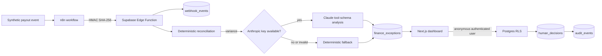

# Architecture

## Trust boundaries

| Boundary | Control |
|---|---|
| public browser → Supabase | publishable key, anonymous Auth session, explicit grants, RLS |
| n8n → Edge Function | HMAC SHA-256 over the exact raw body |
| Edge Function → Postgres | server-side secret key; never shipped to the browser |
| event → reconciliation | schema validation and integer minor units |
| reconciliation → AI | deterministic result is authoritative |
| AI → action | validated tool output is advisory only |
| visitor → decision | decision is bound to `auth.uid()` and cannot update finance rows |

The project has no path that moves money, changes an order, or reaches the Hotmart production system.
