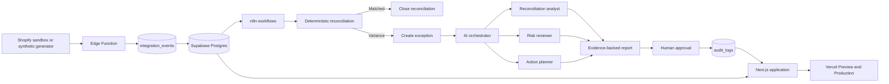

# LedgerGuard AI — Technical Design Document

**Status:** foundation approved for implementation  
**Language:** English, for portfolio and interview review  
**Data classification:** synthetic only in the current milestone

## 1. Context

Multi-brand e-commerce finance teams need to understand why an expected payout differs from an actual payout. Relevant evidence can be split across orders, refunds, fees, payouts, workflow runs, and human decisions.

LedgerGuard AI will centralise that evidence, calculate variance deterministically, open an exception, use bounded AI agents to propose an explanation, and require a human decision. The portfolio edition must remain safe to inspect publicly.

## 2. Goals

- Demonstrate a production-shaped Next.js and TypeScript product.
- Demonstrate Supabase Postgres modelling, explicit grants, RLS, and Edge Functions.
- Demonstrate n8n integration, retry, failure, and observability.
- Demonstrate Claude Code and bounded runtime agents with human oversight.
- Demonstrate disciplined GitHub pull requests and Vercel Preview/Production environments.
- Communicate the system clearly to technical and non-technical reviewers.

## 3. Non-goals

- Move money or change a real order.
- Connect a production Shopify, ERP, NetSuite, or Patchworks account without written authority.
- Claim revenue, accuracy, savings, or operational scale without measured evidence.
- Let an LLM perform monetary calculations or approve an action.
- Build a full identity administration product in the portfolio MVP.

## 4. Primary scenario

The synthetic order `LG-1042` has:

- gross amount: £120.00;
- refund: £20.00;
- fee: £3.50;
- expected payout: £96.50;
- actual payout: £76.50;
- variance: −£20.00.

Deterministic TypeScript calculates the variance. The AI layer receives references to the order, refund, and payout and proposes that the refund may have been deducted twice. A finance manager may approve only the creation of an investigation.

## 5. Current milestone

Implemented:

- Next.js App Router and TypeScript foundation;
- responsive synthetic dashboard;
- overview, exceptions, automations, and audit views;
- deterministic reconciliation module;
- unit tests;
- CI and review templates;
- Claude Code project and specialist reviewer definitions.

Not implemented yet:

- hosted Supabase project;
- schema, migrations, RLS, and Edge Functions;
- n8n workflows;
- Shopify sandbox;
- Anthropic API calls or runtime agents;
- Vercel project and environment separation.

## 6. Target architecture

## 7. Proposed data model

| Table | Purpose | Security boundary |
|---|---|---|
| `profiles` | Minimal user presentation data | own row or authorised managers |
| `brands` | Tenant-like brand boundary | active membership |
| `brand_memberships` | User, brand, and role mapping | member and approved management paths |
| `integration_events` | Immutable idempotent event intake | brand membership; writes through trusted server path |
| `orders` | Normalised commerce order | brand membership |
| `refunds` | Refund evidence | brand membership |
| `payouts` | Payout header | brand membership |
| `payout_items` | Order/payout relation | inherited through payout brand |
| `reconciliations` | Deterministic expected/actual/variance record | brand membership |
| `exceptions` | Human review case | role-aware brand membership |
| `agent_runs` | Versioned AI input references and output | read by assigned brand; write through trusted path |
| `action_proposals` | Advisory next action | analyst/manager read, trusted creation |
| `approvals` | Human decision | manager creation, brand read |
| `automation_runs` | n8n observability | brand-aware where applicable |
| `audit_logs` | Append-only decision trail | read by assigned brand; trusted append only |

The actual migration will be created only after schema and policy review.

## 8. Authorisation model

- No anonymous access to operational tables.
- An authenticated user needs an active `brand_memberships` row for the same `brand_id`.
- Managers can create approvals for assigned brands.
- Analysts can investigate and propose but cannot approve.
- Auditors are read-only.
- Updates must use both row selection and resulting-row checks.
- Grants and policies are explicit and versioned together.
- Every exposed table gets allow and deny tests.
- Browser clients never receive a secret/service-role key.

## 9. Edge Function boundary

`ingest-commerce-event` will:

1. restrict method and content type;
2. limit request size;
3. verify the provider signature before trusting fields;
4. validate a versioned payload schema;
5. use the provider event ID for idempotency;
6. write raw synthetic and normalised evidence;
7. return quickly and leave long work to the workflow layer;
8. log correlation and safe error metadata only.

## 10. n8n boundary

Planned workflows:

- event processing;
- payout reconciliation;
- bounded retry and permanent failure handling;
- AI exception analysis;
- daily summary.

Every public export will be disabled, sanitised, and disconnected. Runs will carry a correlation ID. Replay must be idempotent.

## 11. AI boundary

- deterministic code owns calculations;
- agents receive only necessary evidence;
- outputs use a validated structured schema;
- prompts are versioned;
- every conclusion carries evidence references;
- missing evidence is reported, not invented;
- an unavailable or invalid model response falls back to a safe manual-review state;
- agents cannot approve or execute a financial action.

## 12. Environments

| Environment | Data | Services | Purpose |
|---|---|---|---|
| Local | synthetic seed | local/mocks | development |
| Preview | isolated synthetic | sandbox/mocks | pull request review |
| Production demo | fixed synthetic | no external write | public portfolio |

The project will never share credentials, database, n8n instance, or state with the Hotmart project.

## 13. Verification plan

- lint, TypeScript, unit tests, and production build in CI;
- money and rounding unit tests;
- schema and migration verification from a clean database;
- RLS allow/deny tests for every role and unrelated access;
- webhook signature, size, schema, duplicate, and ordering tests;
- n8n success, retry, permanent failure, and replay tests;
- invalid and unavailable AI response tests;
- keyboard, responsive, empty, loading, and error UI states;
- public demo network inspection proving no external request.

## 14. Observability

- correlation ID from intake through reconciliation and exception;
- structured safe logs;
- `automation_runs` for status, attempt, duration, and error code;
- audit entry for meaningful human or trusted system actions;
- no credentials, auth headers, or personal data in logs.

## 15. Rollout

1. foundation and first Vercel Preview;
2. isolated Supabase schema and RLS tests;
3. event intake and idempotency;
4. deterministic reconciliation workflow;
5. bounded agents and human approval;
6. public synthetic hardening;
7. case study, English demo, and application material.

Each step requires a focused pull request and verification evidence.
